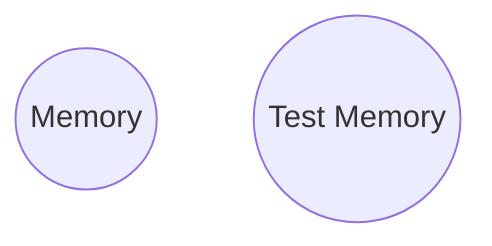

<!-- GENERATED by c4-gen views --format=mermaid — do not edit -->

# C4 — Components -- Soul Protocol — component

Component-level view of Soul Protocol

```mermaid
graph TB
  memory(("Memory"))
  testmemory(("Test Memory"))
```
