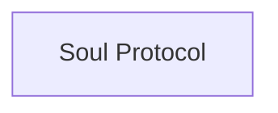

<!-- GENERATED by c4-gen views --format=mermaid — do not edit -->

# C4 — System Context -- soul-protocol — context

How soul-protocol fits in its ecosystem

```mermaid
graph TB
  soul_protocol["Soul Protocol"]
```
